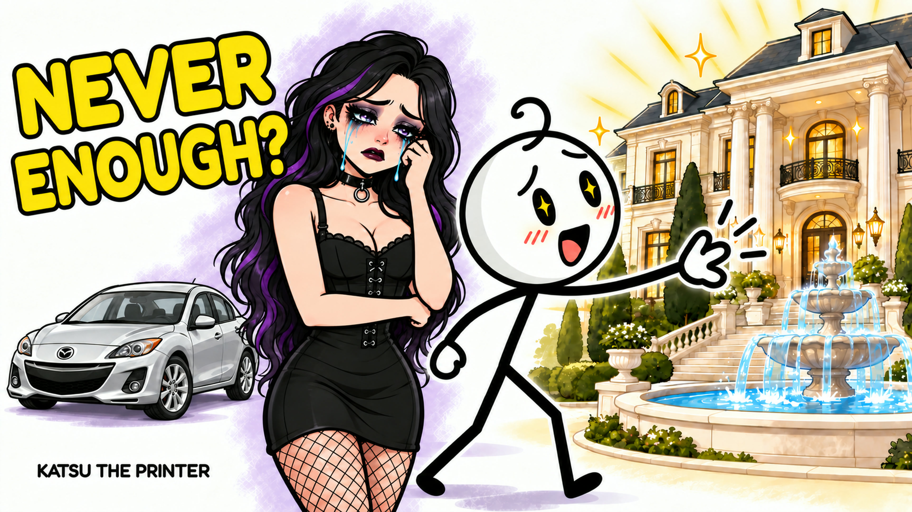
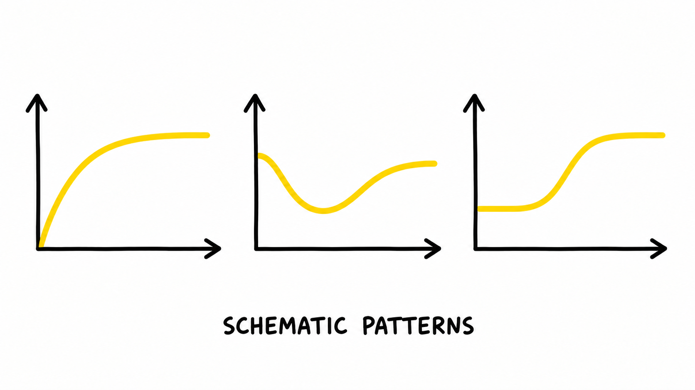
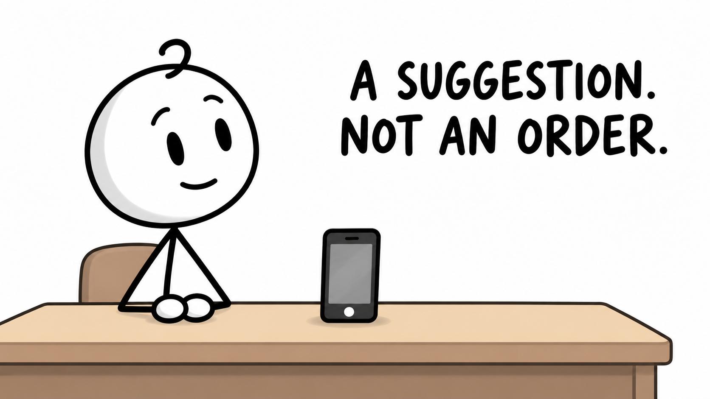

<p align="center">
  <a href="https://www.youtube.com/@KatsuThePrinter">
    
  </a>
</p>

# Katsu Studio

A local **FastAPI + React** studio for Katsu The Printer. Enter a topic and the app automatically researches it, writes an English voiceover, plans scenes, generates original Katsu illustrations and timed narration, shortens pauses, matches images to spoken words, exports a checked 1080p video, and creates its thumbnail.

The eight-minute default is a writing target. The actual recording determines the video length. Illustrations stay still with direct cuts. Thumbnail export is a 3840 × 2160 JPEG under 2 MB with exact lettering added locally.

[**Katsu The Printer on YouTube →**](https://www.youtube.com/@KatsuThePrinter)

## Our first video

**Why Are Humans Never Satisfied?**

“You finally get the thing you wanted—and then your brain starts looking for something else.”

[](https://github.com/TemaDeveloper/katsu-studio/releases/tag/first-video-v1)

[**Download the full video (MP4, 53 MB)**](https://github.com/TemaDeveloper/katsu-studio/releases/download/first-video-v1/why-are-humans-never-satisfied.mp4) · [Release and checksum](https://github.com/TemaDeveloper/katsu-studio/releases/tag/first-video-v1) · [Channel artwork](media/README.md)

The finished pilot runs **9:28 at 1920 × 1080** and uses **120 still illustrations** matched to the narration. It was made during the original assisted production workflow, before the standalone app, and shows the format Katsu Studio is designed to produce.

### Scenes from the first video

| A new goal | Patterns of adaptation |
| --- | --- |
|  |  |
| **Is happiness a button?** | **Comparing achievements** |
|  |  |
| **Value after the excitement fades** | **A suggestion. Not an order.** |
|  |  |

## Run on macOS

Install Python 3.12, Node.js 22 and FFmpeg. With Homebrew:

```sh
brew install python@3.12 node@22 ffmpeg
git clone https://github.com/TemaDeveloper/katsu-studio.git
cd katsu-studio
./automation/run.command
```

The launcher installs the backend and builds the frontend on first use, then opens **http://127.0.0.1:8850**. Leave its terminal open during production. The app includes the channel avatar and illustration reference, so a fresh checkout works without the owner's original video files.

In **Settings**, save your OpenAI and ElevenLabs API keys privately, load your account's voices, choose a narrator, check connections, and set an estimated spending limit. Then enter a topic in **New video**. API billing is separate from ChatGPT subscriptions; model and voice access depend on your accounts. No credentials are included in this repository.

## What is included

- `automation/backend/`: FastAPI routes, persisted job worker, provider adapters, request spending records, recovery, audio/timing, video verification and thumbnail generation.
- `automation/frontend/`: React/TypeScript interface for topics, progress, completed videos, narration, image/wording pairs, thumbnails, sources and settings.
- `compose_video.py` and `remove_reader_pauses.py`: reusable local production tools.
- Tests, frontend dependency lockfile, channel assets and the licensed Fredoka font.
- [Full operating guide](automation/README.md), [product constraints](automation/PRODUCT.md), [design system](automation/DESIGN.md), and [verification record](automation/VERIFICATION.md).

## Saved work and privacy

Projects live in `automation/data/`. API keys stay in macOS Keychain or the server's `OPENAI_API_KEY` and `ELEVENLABS_API_KEY` environment variables. The local server binds to loopback. Original recordings, runtime episode images, generated videos, project databases, local test evidence and credentials are excluded from Git. The explicitly shared artwork in `media/` and first-video release are the public showcase.

Successful production work is reusable after a stop or failure. Unknown paid-request outcomes require explicit acknowledgement and are never automatically replayed. The spending limit gates conservative estimates, not the provider's final bill. Thumbnail regeneration reuses the finished video and narration. The app does not publish to YouTube.

**Bring in our first video** is an optional owner-only import. It requires the complete original `output/` and narration/prompt files from the owner's workspace; those are intentionally absent from a public checkout. The downloadable video and selected showcase images are not a complete import bundle. New-topic production works without them.

## Development and checks

```sh
python3.12 -m venv automation/.venv
automation/.venv/bin/python -m pip install -e 'automation/backend[test]'
automation/.venv/bin/python -m pytest automation/backend/tests test_compose_video.py -q
cd automation/frontend
npm ci
npm run build
```

The normal backend tests exercise real persistence, background jobs, FFmpeg exports, timing, budgets, resumable requests and thumbnail assembly, replacing only paid provider boundaries with explicitly synthetic responses. Two owner-only historical-episode tests skip when the private episode is absent. Tests do not require API keys or spend API credits.

The `verify-*.cjs` browser scripts are optional checks for the owner's populated local workspace. They require Playwright (`npm install --no-save playwright`) and Chrome, plus the local episode or fixture data described in the verification record. Their local evidence files are not part of this repository.

Real Studio generation using the owner's OpenAI/ElevenLabs accounts remains unverified until keys are supplied. A connection check alone does not prove a complete provider run.

## Font attribution

Fredoka is distributed under the [SIL Open Font License](automation/backend/katsu/assets/OFL.txt). The bundled font and its license are preserved together. Frontend font files are supplied by `@fontsource-variable/fredoka`.
