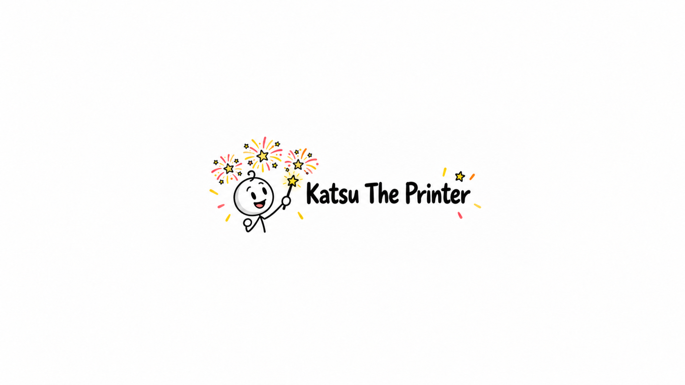

# Katsu The Printer showcase

[Visit Katsu The Printer on YouTube](https://www.youtube.com/@KatsuThePrinter).

## Channel identity

| Artwork | File | Dimensions |
| --- | --- | --- |
| Avatar | [PNG](branding/avatar.png) | 1024 × 1024 |
| Upload-size avatar | [PNG](branding/avatar-150.png) | 150 × 150; under 1 MB |
| YouTube banner | [PNG](branding/banner.png) | 2560 × 1440 |

## First video: Why Are Humans Never Satisfied?

[Download the full video](https://github.com/TemaDeveloper/katsu-studio/releases/download/first-video-v1/why-are-humans-never-satisfied.mp4) · [Release and checksum](https://github.com/TemaDeveloper/katsu-studio/releases/tag/first-video-v1) · [4K thumbnail](first-video/thumbnail.jpg)

- Duration: 9 minutes, 28 seconds.
- Video: 1920 × 1080, H.264, with AAC narration.
- Format: 120 still illustrations with direct cuts timed to the spoken words.
- Thumbnail: 3840 × 2160 JPEG, under 2 MB.

This pilot was made during the original assisted production workflow, before the standalone app. Its actual recording determines its length; the original eight-minute request was a writing target.

## Selected illustrations

These are six original illustrations from the episode. Their shot numbers preserve their position in the original 120-image sequence.

| Shot | Illustration | Narration excerpt |
| --- | --- | --- |
| 001 | [A new goal](first-video/images/shot-001.png) | You finally get the thing you wanted—and then your brain starts looking for something else. |
| 029 | [Patterns of adaptation](first-video/images/shot-029.png) | They found different patterns for different events, and different measures of wellbeing. |
| 054 | [The happiness button](first-video/images/shot-054.png) | Calling it a pleasure button hides more than it explains. |
| 081 | [Comparing achievements](first-video/images/shot-081.png) | You may judge your life against what you have, and what others have. |
| 110 | [Value after excitement fades](first-video/images/shot-110.png) | You can also notice what an improvement keeps doing after excitement fades. |
| 120 | [A suggestion. Not an order.](first-video/images/shot-120.png) | It can mean you've stopped treating every suggestion as an instruction to obey. |

The artwork is stored in the repository; the full MP4 and its SHA-256 checksum are attached to the first-video release. Runtime project storage, original narration recordings, credentials and private production records remain outside the public showcase.
